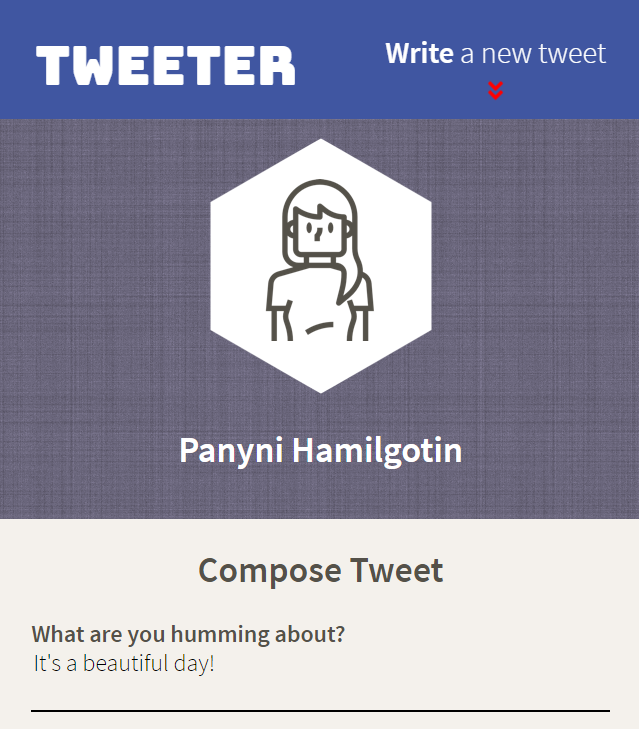

# Tweeter Project

Tweeter is a simple single-page Twitter clone:
- Designed to be responsive on a variety of devices.
- Powered by HTML, CSS, and jQuery on the front-end, Express and Node.js on the backend.
- Utilizes AJAX requests to communicate with the server.

Built as a project for the Lighthouse Labs coding bootcamp.

## Screenshots

## Getting Started

1. Fork this repository, then clone your fork of this repository.
2. Install dependencies using the `npm install` command.
3. Start the web server using the `npm run local` command. The app will be served at <http://localhost:8080/>.
4. Go to <http://localhost:8080/> in your browser.

## Dependencies

- Express
- Node 5.10.x or above
